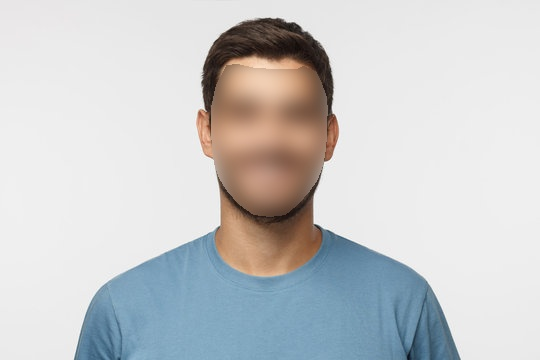
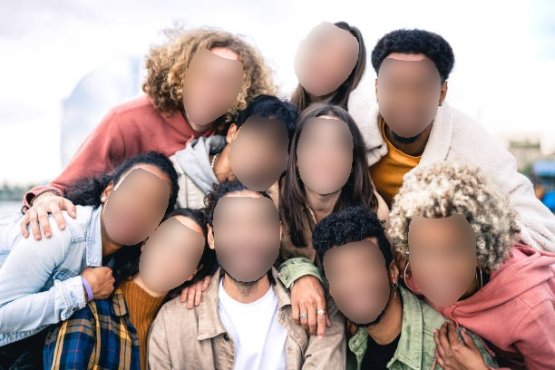
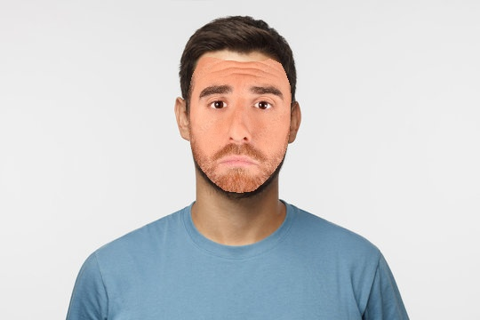
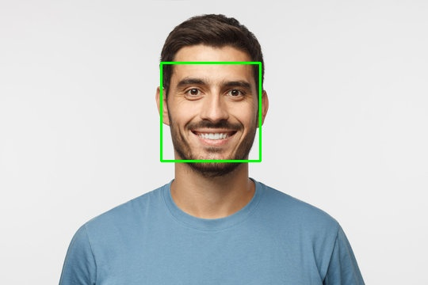
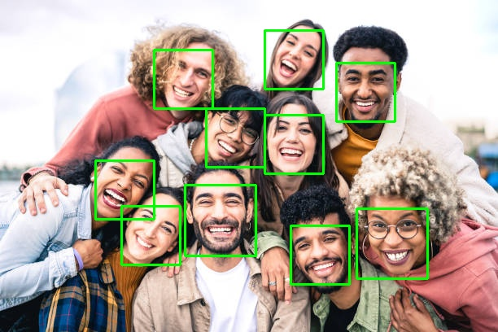
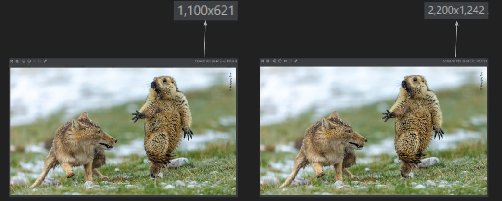
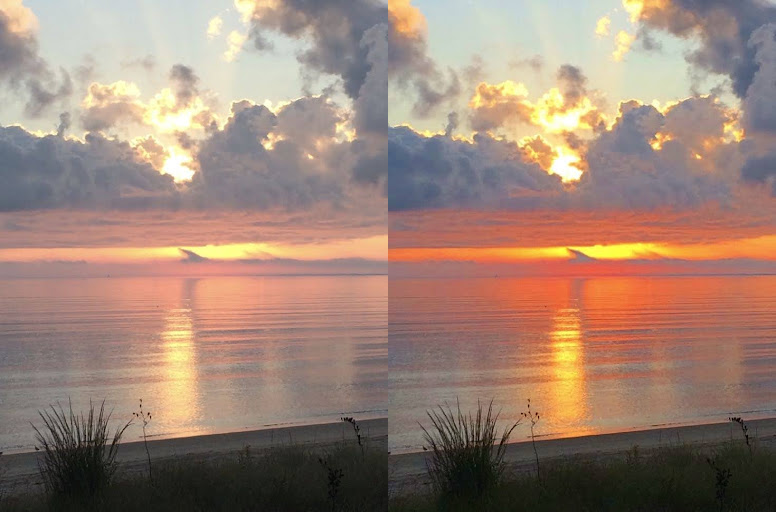
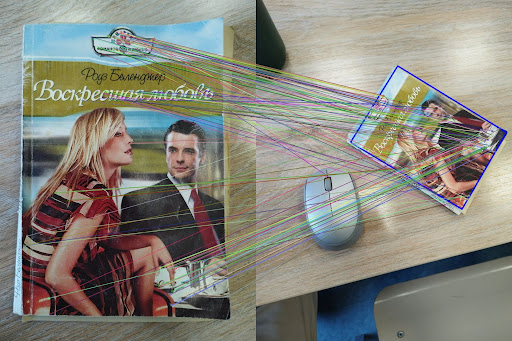

#      
# CVIP
CVIP stands for Computer Vision Image Processing tool, that is an open-source, convenient, fast and flexible command line tool for editing pictures with the use of Computer Vision methods.

Main features:
--------------
# `Blurring faces` (photo/video)
## How to use?
`./CVIP [-i=../examples/man.jpg]face_blur:10[-o=../examples/blurred_man]` with photos

 

 

`./CVIP -v [-i=your_video.mp4]face_blur:10[-o=out]` with videos
 

# `Crop` (photo/video)
## How to use?
`./CVIP [-i=../examples/man.jpg]crop:10:35:320:300[-o=../examples/cropped_man]` with photos

`./CVIP -v [-i=../examples/woman.mov]crop:100:350:520:500[-o=../examples/cropped_woman]` with videos

# `Overlaying masking` (photo/video)
## How to use?
`./CVIP [-i=../examples/man.jpg]mask:../examples/mask.jpg[-o=../examples/man_with_a_mask]` with photos

`./CVIP -v [-i=../examples/woman.mov]mask:../examples/mask.jpg[-o=../examples/woman_with_a_mask]` with videos

# `Face detection` (photo/video)
## How to use?
`./CVIP [-i=../examples/man.jpg]face_detection[-o=../examples/detected_face_man]` with photos

`./CVIP -v [-i=../examples/woman.mov]face_detection[-o=../examples/detected_face_woman]` with videos

# `Upscaling/Downscaling with some scale factor` (photo/video)
## How to use?
`./CVIP [-i=../examples/man.jpg]nn_scale_with_factor:2[-o=../examples/man_x2_nn]` with photos
`./CVIP [-i=../examples/man.jpg]bilinear_scale_with_factor:2[-o=../examples/man_x2_bilinear]` with photos

`./CVIP -v [-i=../examples/woman.mov]nn_scale_with_factor:2[-o=../examples/woman_x2_nn]` with videos
`./CVIP -v [-i=../examples/woman.mov]bilinear_scale_with_factor:2[-o=../examples/woman_x2_bilinear]` with videos

# `Upscaling/Downscaling to some resolution` (photo/video)
## How to use?
`./CVIP [-i=../examples/man.jpg]scale_to_resolution:1000:1000[-o=../examples/man_1000_1000]` with photos
`./CVIP -v [-i=../examples/woman.mov]scale_to_resolution:1000:1000[-o=../examples/woman_1000_1000]` with videos

# `Motion Tracking` (video)
## How to use?
`./CVIP -v [-i=../examples/run.mov]motion_tracking[-o=../examples/run_motion]` with videos

# `Saturation` (photo)
## How to use?
`./CVIP [-i=../examples/sunset.jpg]saturation:2[-o=../examples/saturation]` with photos

# `Flip horizontally/vertically` (photo/video)
## How to use?
`./CVIP [-i=../examples/man.jpg]flip:horizontal[-o=../examples/man_flipped_hor]` with photos

`./CVIP -v [-i=../examples/woman.mov]flip:vertical[-o=../examples/woman_flipped_vert]` with videos

# `Overlay one video with another` (video)
## How to use?

`./CVIP -v [-i=../examples/RIHANNA_DIAMONDS.mp4]video_overlay:../examples/surdo.mp4:4:10:30:1[-o=../examples/rihanna_overlayed]` with videos

# `Reverse` (video)
## How to use?
`./CVIP [-i=../examples/woman.mov]reverse[-o=../examples/woman_reversed]` with videos

# `Panorama` (video)
## How to use?

# `Feature Matching` (photo/video)
## How to use?
`./CVIP [-i=match1.png]feature_matching:BF:match2.png[-o=matched]`

# Building:
Open the root directory of the CVIP project you've downloaded. There should be CVIP.spec file.
Building should be done with pyinstaller with the following command:

`pyinstaller CVIP.spec`

After that, pyinstaller will create `build` directory and `dist` directory.
Executable file of CVIP will be placed in the `dist` directory.
