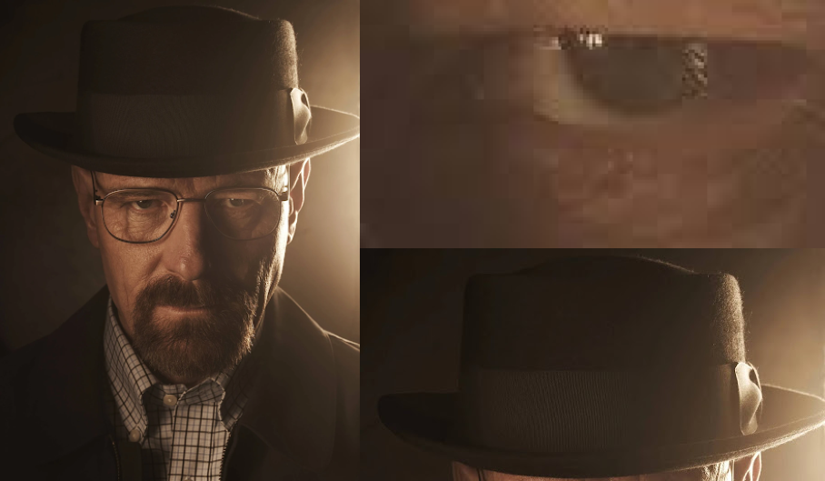
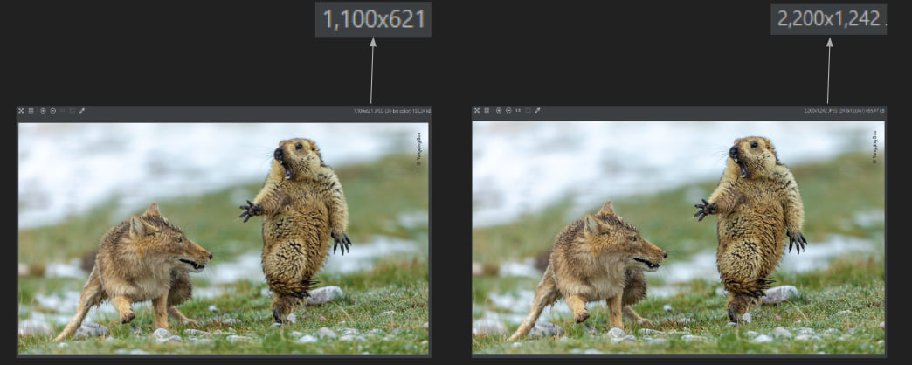
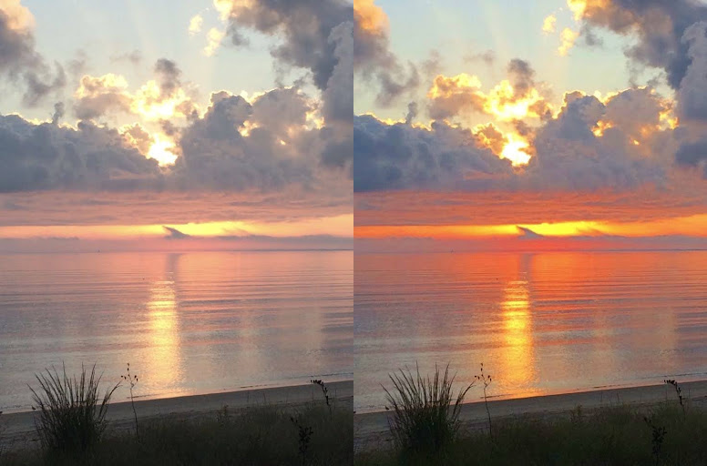
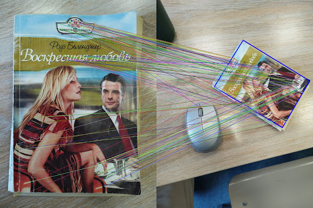

#      
# CVIP
CVIP stands for Computer Vision Image Processing tool, that is a convenient, fast and flexible command line tool for editing pictures with the use of Computer Vision methods.

Main features:
--------------
  - `Blurring faces` (photo/video)

./CVIP [-i=Gentlemen.png]face_blur:10[-o=blurred]
  - `Crop` (photo/video)

./CVIP [-i=walter.png]crop:700:650:850:730[-o=eye]
  - `Overlaying masking` (photo/video)

./CVIP [-i=photo.jpg]mask:man.jpg[-o=masked]
  - `Face detection` (photo/video)

./CVIP [-i=photo.jpg]face_detection[-o=detected]
  - `Upscaling/Downscaling with some scale factor` (photo/video)

./CVIP [-i=animals.png]nn_scale_with_factor:2[-o=scaled1]
./CVIP [-i=animals.png]bilinear_scale_with_factor:2[-o=scaled2]
  - `Upscaling/Downscaling to some resolution` (photo/video)

./CVIP [-i=bateman.png]scale_to_resolution:1280:300[-o=blooper]
  - `Motion Tracking` (video)

./CVIP -v [-i=runner.mp4]motion_tracking[-o=tracked]
  - `Saturation` (photo/video)

./CVIP [-i=sunset.png]saturation:1.2[-o=saturated]
  - `Flip horizontally/vertically` (photo/video)
  - `Overlay one video with another` (video)
  - `Reverse` (video)
  - `Panorama` (video)
  - `Feature Matching` (photo/video)

./CVIP [-i=match1.png]feature_matching:BF:match2.png[-o=matched_showcase]

## Building:
Open the root directory of the CVIP project you've downloaded. There should be CVIP.spec file.
Building should be done with pyinstaller with the following command:

`pyinstaller CVIP.spec`

After that, pyinstaller will create `build` directory and `dist` directory.
Executable file of CVIP will be placed in the `dist` directory.
